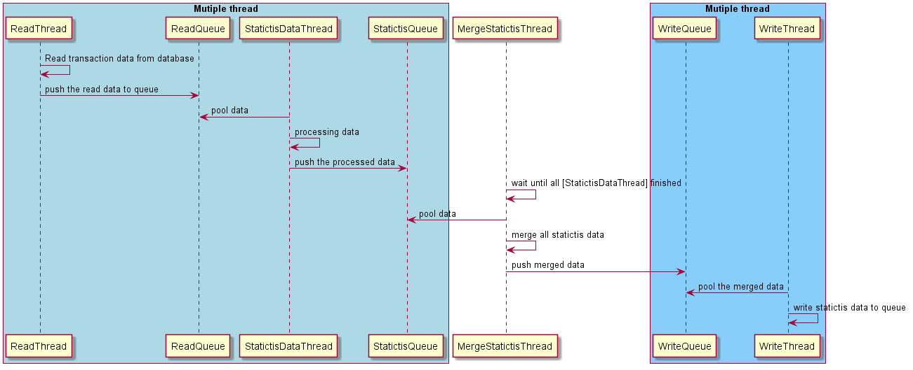

# Satistic large data

## Problem

You are given large data of store's transaction with detail as flowing
Table named IbftTransaction will record all transaction of system with columns

- transactionId: identity the transaction, each transaction with unique number
- userId: the identity of user who did the transaction
- amount: amount of money for this transaction
- status: the status of transaction 0: fail, 1: success

You need to do a statistic with given data to answer the question

- How many transaction is done by each user
- Total amount be each user
- Total fail/ success transaction by each user

Assumption

- Total given records data is 100 million rows with 1 million users

## Solution

- Seperating the whole process into 4 steps

  - Read data: read a part data from data base. Using multi thread for reading data
  - Statictis data: processing a part of data. Using multi thread for processing data
  - Merge statictis: when both of the read data process and statictis data process are finished. The merge statictis process will run.
  - Write data: write the ouput to datbase. Using multi thread for write data



## Explaining

- Performance
  - Seperating the big task into many small task and let's them run parallel will get more fast.
- Memory
  - Not need to huge memory for storing 100 million rows because it's store in Queue. This queue can be implemented in seperate machine.
- Don't need to merge statictis data thread by moving the logic of merge statictis data into write data thread so you don't need to waiting for all read data thread and proccessing data thread be finished.

## How to run

- Install MySql database
- Import database: /mysql/statistics-large-data.sql
- Generating dummy test data:

```
mvn clean compile assembly:single
```

```
java -cp statistics-large-data-1.0-SNAPSHOT-jar-with-dependencies.jar com.smile.dummydata.DummyDataMain
```

- Run statictis process:

```
java -cp statistics-large-data-1.0-SNAPSHOT-jar-with-dependencies.jar com.smile.app.Application
```
